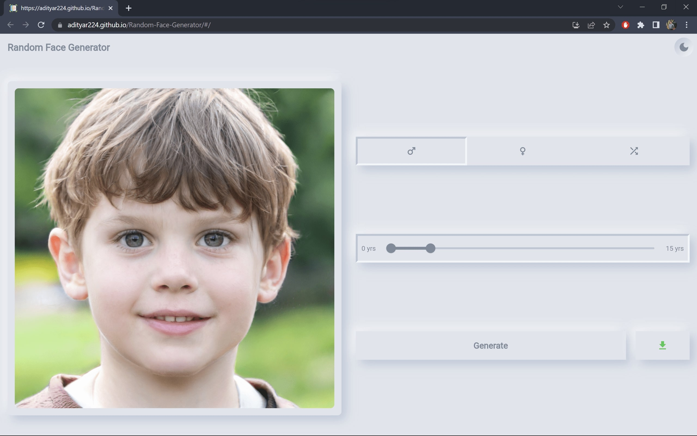
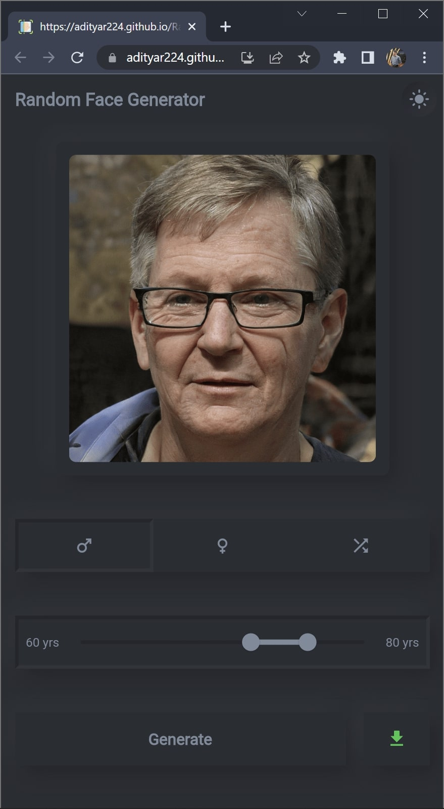

# 👨👩 Flutter Random Face Generator

A flutter app to generate random faces. The Generated faces do not actually exist in real life (in other words you could catfish without getting in trouble 😉 jk jk pls don't catfish). This app uses the [thispersondoesnotexist](https://thispersondoesnotexist.com/) and the [fakeface](https://hankhank10.github.io/fakeface/) api.
Each image has been pre-analyzed by an AI algorithm called [pypy-agender](https://github.com/aristofun/py-agender) to identify the gender and age.

Please star⭐ the repo if you like what you see😊.

## ✨ Features

- [x] Generate a Random Face
- [x] Filter by Gender
- [x] Filter by a Age Range
- [x] Download Face Image
- [x] Switch Theme Mode (Dark and Light)
- [x] Responsive Design
- [x] Multi Platform Support

## 📸 Screenshots

- **Mobile**

| Light | Dark |
| - | - |
|  |  |
|  |  |

- **Desktop**

| Light | Dark |
| - | - |
|  |  |
|  |  |

## 🔌 Plugins

| Name | Usage |
| - | - |
| [**http**](https://pub.dev/packages/http) | Api Calls |
| [**flutter_lints**](https://pub.dev/packages/flutter_lints) | For linting |
| [**hive**](https://pub.dev/packages/hive) | For preference persistence |
| [**hive_flutter**](https://pub.dev/packages/hive_flutter) | Extension for hive |
| [**download**](https://pub.dev/packages/download) | For downloading the image |
| [**path_provider**](https://pub.dev/packages/path_provider) | For getting the path to download the image |
| [**flutter_native_splash**](https://pub.dev/packages/flutter_native_splash) | To show the splash screen |
